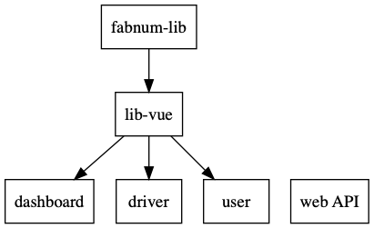

# Installation locale e-Chauffeur

Pour installer e-Chauffeur sur un environnement local, sans docker, pour le développement, il faudra installer chacun des 4 projets.

## Prérequis

Tout d'abord, il faudra installer quelques prérequis : 

* MongoDB >= 3.8
* NodeJS >= 12
* Git

## Web API

Pour installer cet projet, il faut :

* Cloner le projet [e-chauffeur_api](https://github.com/fabnumdef/e-chauffeur_api)
* Installer les dépendances via la commande `npm install`
* Copier la config via la commande `cp config.json.dist config.json`
* Modifier la configuration config.json à votre guise
* Lancer l'application via la commande `npm run serve`

## Dashboard (application régulateur)

Pour installer cet projet, il faut :

* Cloner le projet [e-chauffeur_dashboard](https://github.com/fabnumdef/e-chauffeur_dashboard)
* Installer les dépendances via la commande `npm install`
* Définir une variable d'environnement API_URL contenant le chemin vers la web API.
* Lancer l'application via la commande `npm run dev`

## Driver (application chauffeur)

Pour installer cet projet, il faut :

* Cloner le projet [e-chauffeur_driver](https://github.com/fabnumdef/e-chauffeur_driver)
* Installer les dépendances via la commande `npm install`
* Définir une variable d'environnement API_URL contenant le chemin vers la web API.
* Lancer l'application via la commande `npm run dev`

## User (application soutenu)

Pour installer cet projet, il faut :

* Cloner le projet [e-chauffeur_user](https://github.com/fabnumdef/e-chauffeur_user)
* Installer les dépendances via la commande `npm install`
* Définir une variable d'environnement API_URL contenant le chemin vers la web API.
* Lancer l'application via la commande `npm run dev`
